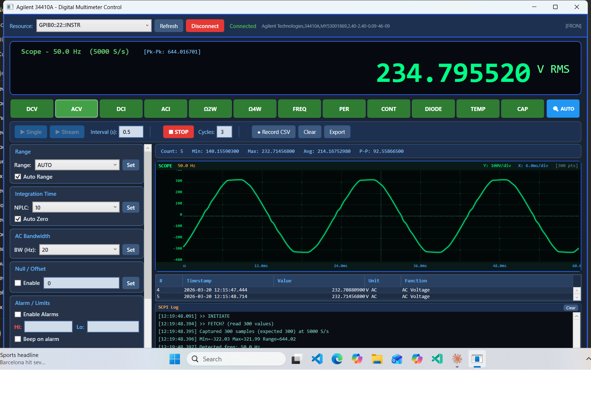
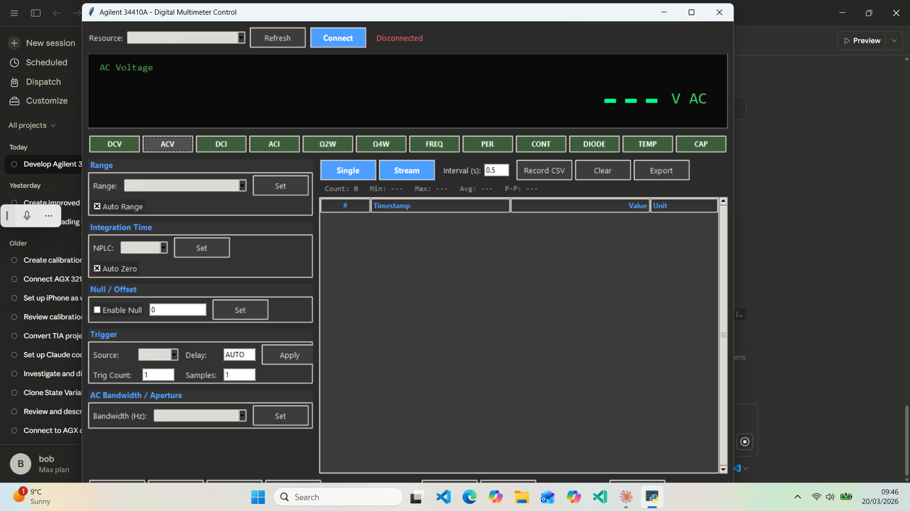

# Agilent 34410A Intelligent DMM Interface with Data Logging & Scope Trace

A professional WPF (C#/.NET 9) application for controlling the Agilent/Keysight 34410A 6.5-digit Digital Multimeter via GPIB, featuring a real-time oscilloscope display, data logging, and intelligent auto-detection.



## Features

### 12 Measurement Functions
- **DC Voltage** (DCV) - with auto/manual range
- **AC Voltage** (ACV) - True RMS
- **DC Current** (DCI)
- **AC Current** (ACI)
- **2-Wire Resistance** (2W)
- **4-Wire Resistance** (4W)
- **Frequency** (FREQ)
- **Period** (PER)
- **Continuity** (CONT) - with audible beep
- **Diode Test** (DIODE)
- **Temperature** (TEMP) - RTD/Thermistor
- **Capacitance** (CAP)

### Real-Time Oscilloscope Display
- **Live waveform capture** using the 34410A's high-speed digitize mode
- **5000 samples/second** at NPLC 0.006 with timer-based sampling (SAMP:SOUR TIM)
- **50Hz/60Hz AC waveform display** with configurable number of cycles (1-20, default 8)
- **Auto-amplitude scaling** with nice Y-axis divisions and padding
- **Auto time-base** with ms/div labels
- **Adjustable time base slider** - zoom in/out on the waveform (drag left to zoom in)
- **Trigger level slider** - adjustable trigger threshold with visual indicator line
- **Measurement cursors** - two draggable cursors with delta-V, delta-T, and frequency readout
- **Phosphor green trace** with triple-layer glow effect on dark scope background
- **Zero-crossing frequency detection** for accurate Hz display
- **Pk-Pk voltage** and **RMS** readout
- **Graticule grid** with dot markers (classic oscilloscope look)
- **Cycle trimming** - displays exact whole cycles for clean, stable waveform
- **Screenshot button** - capture scope display to PNG file

### Intelligent Auto-Detection
- **AUTO button** probes the input and automatically selects the correct measurement function
- Distinguishes between AC and DC signals
- Auto-starts streaming after detection
- Detects resistance, voltage, and current

### Data Streaming & Recording
- **Live streaming** with configurable rate display
- **CSV recording** to file with timestamps, values, units, and function
- **Decimal format** in logs (not scientific notation)
- **Data grid** showing all readings with statistics

### Statistics & Analysis
- **Min / Max / Average / Peak-to-Peak** running statistics
- **Reading counter** with rate monitor (readings/sec)
- **Relative mode** - capture a reference value and display delta
- **Alarm/Limits** - set Hi/Lo thresholds with optional beep alert

### Instrument Control
- **Range control** - Auto or manual range selection
- **Integration time** (NPLC) - 0.006 to 100 PLC
- **Auto-zero** enable/disable
- **AC bandwidth** selection
- **Trigger configuration** - source, delay, count
- **Math/Statistics** functions
- **Temperature probe** configuration (RTD/Thermistor type and units)
- **Front/Rear terminal** detection
- **Display text** - send custom messages to the meter's front panel
- **Self-test**, **Reset**, **Error query**, **Beep**
- **Instrument Info** dialog

### SCPI Debug Log
- **Real-time SCPI command log** panel showing all commands sent and responses received
- Essential for debugging and verifying instrument communication
- Logs to both UI panel and file (`scope_debug.log`)

## Requirements

### Hardware
- **Agilent/Keysight 34410A** (or 34411A) Digital Multimeter
- **GPIB interface** (NI GPIB-USB-HS or similar)
- GPIB cable

### Software
- **Windows 10/11**
- **.NET 9.0 SDK** (or later)
- **NI-VISA** runtime (National Instruments VISA drivers)
- **NI-488.2** GPIB drivers

## Installation

1. Install [NI-VISA](https://www.ni.com/en/support/downloads/drivers/download.ni-visa.html) and NI-488.2 drivers
2. Connect GPIB adapter and cable to the 34410A
3. Clone this repository:
   ```
   git clone https://github.com/bob10042/Agilent-34410A-inteligent-interface-with-data-logging-and-scope-trace.git
   ```
4. Build and run:
   ```
   cd Agilent34410A
   dotnet build
   dotnet run
   ```

## Usage

### Basic Operation
1. Launch the application
2. Select your GPIB resource from the dropdown (e.g., `GPIB0::22::INSTR`)
3. Click **Connect**
4. Select a measurement function (DCV, ACV, etc.) or click **AUTO** for auto-detection
5. Click **Single** for one reading, or **Stream** for continuous readings
6. Click **Record** to log data to a CSV file

### Oscilloscope Mode
1. Connect an AC signal to the meter inputs
2. Set the number of cycles to display (default: 8)
3. Click **SCOPE** to start the live waveform display
4. The meter enters high-speed digitize mode (5000 S/s, NPLC 0.006)
5. Waveform updates continuously with frequency, RMS, and Pk-Pk readings
6. Use the **T/div slider** to zoom the time base (drag left to zoom in)
7. Adjust the **Trigger slider** to set the trigger level threshold
8. Enable **Cursors** checkbox and drag the two cursor sliders to measure voltage and time differences
9. Click the **camera icon** to save a screenshot of the scope display
10. Click **STOP** to return to normal meter operation

**Note:** During scope mode, the meter's front panel display is disabled to maximize acquisition speed and prevent beeping. The display restores automatically when you stop the scope.

### Data Export
- Click **Export** to save the data grid contents
- Click **Record** to start/stop CSV logging
- CSV files include: timestamp, value, unit, and measurement function

## Technical Details

### Oscilloscope Implementation
The scope uses the 34410A's built-in digitize capability:
- `CONF:VOLT:DC 1000` - Fixed 1000V DC range
- `VOLT:DC:NPLC 0.006` - Fastest integration (120us aperture at 50Hz)
- `SAMP:SOUR TIM` / `SAMP:TIM 0.0002` - Timer-based sampling at 200us intervals
- `SAMP:COUN` - Configurable sample count (100 per cycle)
- `DISP OFF` + `SYST:BEEP:STAT OFF` - Silent acquisition
- `INITIATE` + `FETCH?` - Burst capture with multi-read GPIB transfer

### Communication
- NI-VISA via `NationalInstruments.Visa` NuGet package (v25.5.0.13)
- GPIB (IEEE 488.2) SCPI commands
- Async Task-based streaming with UI dispatcher updates

### Safety
The oscilloscope mode is completely safe for the 34410A. It uses standard SCPI commands documented in the programmer's manual. The meter simply takes fast DC voltage readings - no risk of damage.

## Project Structure
```
Agilent34410A/
  Agilent34410A.csproj    - Project file (.NET 9, WPF)
  MainWindow.xaml          - UI layout (~660 lines XAML)
  MainWindow.xaml.cs       - Code-behind (~2013 lines C#)
screenshots/
  scope_50hz_sinewave.png  - Live 50Hz waveform capture
  scope_50hz_sinewave2.png - Waveform capture (alternate view)
  main_interface.png       - Main application interface
README.md                  - This file
.gitignore                 - Git ignore rules
```

## Screenshots

### Live Oscilloscope - 50Hz Mains Waveform


### Main Interface


## License
This project is provided as-is for educational and personal use.

## Acknowledgments
- Built with the Agilent 34410A/34411A Programmer's Reference
- NI-VISA for GPIB communication
- WPF for the user interface
